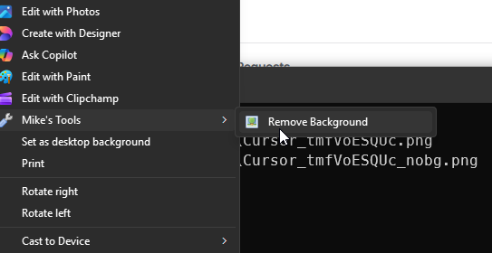

#  cutout

Right-click a photo to get a copy with the background removed

Windows · macOS

<!-- media: hero -->
<!--  -->
<!-- /media: hero -->

## What it is

A small wrapper around rembg using the birefnet-portrait model, so it works best on photos of people. Right-click an image and you get a new copy with the background gone, saved next to the original.

The first run downloads about 1 GB of model weights, so give it a minute that first time.

Previously called `removebg`.

The right-click action is on Windows. On macOS, use the terminal command.

## Get it

Paste this into your AI coding agent (Claude Code, Codex, Cursor...):

> Clone https://github.com/mikecann/cutout and make it my own. It's one of Mike
> Cann's personal tools, so read the README first, change anything specific to his
> setup to suit mine, then help me get it running.

### Or set it up by hand

You need Git and Python with pip on PATH. The current [rembg requirements and installation guide](https://github.com/danielgatis/rembg#installation) lists supported Python versions. Python 3.12 is a good starting point. No API keys or `.env` file are needed for this local model.

```sh
git clone https://github.com/mikecann/cutout
cd cutout
```

**Windows**

```powershell
powershell -ExecutionPolicy Bypass -File install.ps1
```

The installer runs `deps.ps1`, which installs `rembg[gpu,cli]` and falls back to `rembg[cpu,cli]` if that install fails. It creates command stubs in `C:\dev\tools`, offers to add that folder to your user PATH, and adds the Explorer action. Open a new terminal afterwards.

If you already have rembg set up, pass `-SkipDeps`. You can also choose another command folder with `-ToolsDir 'C:\my-tools'`. Keep the clone path ASCII so the batch stub can point to it correctly.

**macOS**

Use a Python virtual environment to keep the dependencies together:

```sh
python3 -m venv .venv
source .venv/bin/activate
python -m pip install "rembg[cpu,cli]"
bash install.sh
```

The installer symlinks `cutout` into `~/.local/bin`. Follow its PATH instruction if needed. Activate `.venv` in each terminal before using cutout so the `rembg` command is available. Pass another directory to `install.sh` if you prefer, for example `bash install.sh "$HOME/bin"`.

Keep the clone around, the installed commands point to it. After moving it, rerun the installer.

## Using it

From a terminal:

```sh
cutout "path/to/photo.png"
```

From Windows File Explorer, right-click an image and choose **Mike's Tools > Cutout (Remove Background)**. On Windows 11, click **Show more options** first to get the classic menu.

The Explorer action is registered for `.jpg`, `.jpeg`, `.png`, `.webp`, `.bmp`, `.tiff` and `.tif`.

Output is saved alongside the input with `_nobg` before the original extension, for example `photo_nobg.png` or `photo_nobg.jpg`. The original stays in place. A later run on the same input uses the same output path.

## Screenshots




## Dependencies and troubleshooting

The launchers call [rembg](https://github.com/danielgatis/rembg) with `birefnet-portrait`. There is no compile step. The GPU package needs a compatible NVIDIA/CUDA setup; an installation succeeding does not guarantee your GPU is ready. If it fails at runtime, use `python -m pip install "rembg[cpu,cli]"` in your Python environment, following rembg's installation guide.

If `rembg` is not found, check that the Python environment is active and its Scripts folder on Windows, or bin folder on macOS, is on PATH. You can check the dependency without downloading a model with `rembg --help`.

The output keeps the original extension, including `.jpg`. If you need transparency in another app, check the output format before using it. This naming behaviour is kept from the original tool.

The Windows batch launcher uses delayed expansion, so filenames containing `!` are a known limitation.

## Uninstalling

On Windows:

```powershell
powershell -ExecutionPolicy Bypass -File uninstall.ps1
```

If you installed into a custom folder, pass the same `-ToolsDir` here. This removes cutout's command stubs, Explorer verbs and generated cutout icon. It leaves other tools' verbs, the shared submenu and icon, PATH entries, Python packages and model weights in place.

On macOS:

```sh
bash uninstall.sh
```

Pass the same directory if you chose a custom one. It only removes a symlink pointing at this clone.

## Development

```sh
python3 -m unittest discover -s tests -v
bash -n cutout install.sh uninstall.sh
pwsh -NoProfile -File tests/check-ps1.ps1
pwsh -NoProfile -File tests/test-install.ps1
pwsh -NoProfile -File tests/test-deps.ps1
```

Use `python` on Windows. These tests use a fake rembg command, so they need no GPU, secrets or model weights. CI runs on Windows and macOS. A real image run is still needed to check model quality and the local inference setup.

The picture and wrench icons are from Mark James's [famfamfam Silk icon set](https://www.famfamfam.com/lab/icons/silk/), licensed under [CC BY 2.5](https://creativecommons.org/licenses/by/2.5/).

## More tools

My other personal tools are at [mikerosoft.app](https://mikerosoft.app).

MIT licensed.
